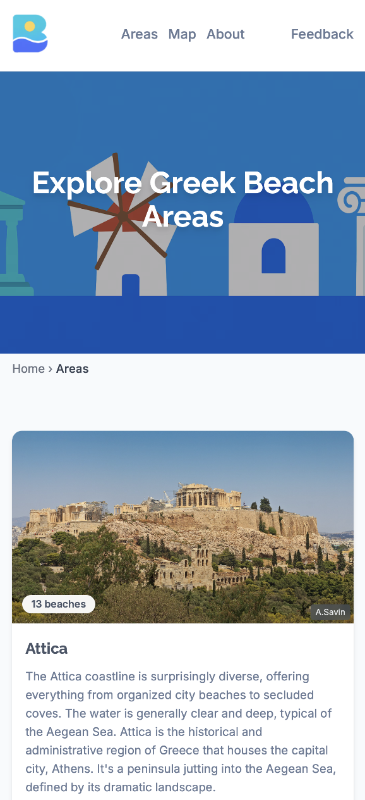

## Hey, I'm Tomer 👋

**CTO & Co-Founder at [Bridge](https://bridge.ls)** — an AI engineer companion for CS teams.

CS teams know exactly what their customers need — a custom dashboard, a new exported field, a specific metric — but those asks usually don't make the engineering roadmap and quietly become churn. Bridge is that engineer companion: an LLM wired into your product's backend with guardrails, so a CS rep can describe a customer's ask in chat and get a working dashboard or export back without escalating to engineering.

### What I care about

- **LLMs that ship real work into customer hands** — not chatbots, not demos.
- **Production AI guardrails** — the boring stuff that lets an LLM safely touch a customer's backend.
- **The DX of LLM-native internal tools** — what changes when the engineer in the room is an LLM.

### Before Bridge

Built full-stack products reaching millions of users across Europe and the Middle East — from a ~2M-user B2C platform at SENSORY-MINDS to an AI-driven travel startup I presented at Google's AI Founders Connect. BSc Computer Science, Aberystwyth University. Served as a computer and network engineer in the Hellenic Navy.

### Featured project — Beaches of Greece

[**beachesofgreece.com**](https://beachesofgreece.com) — AI-powered beach discovery for Greece: 200+ beaches with natural-language search ("a quiet sandy beach with a taverna near Heraklion"), interactive satellite maps, and editorial guides. Built with React, TypeScript, and Supabase, with a custom NLP search pipeline and SEO-driven static rendering.

<table>
  <tr>
    <td width="50%"></td>
    <td width="50%"></td>
  </tr>
  <tr>
    <td width="50%"></td>
    <td width="50%"></td>
  </tr>
</table>

### Code

- [Bridge CLI](https://github.com/usebridgeai/cli) — OpenAPI→MCP server generation, managed OAuth 2.1 (AGPL-3.0)
- [Grind](https://github.com/tomer-liran/grind) — open-source workout PWA, fork it and edit one file to match your gym

### Where to find me

- Building: [bridge.ls](https://bridge.ls)
- Writing: [The CS notebook](https://bridge.ls/blog) · [X / Twitter](https://x.com/tomerlrn)
- Professional: [LinkedIn](https://linkedin.com/in/tomer-liran)

---

*Based in Frankfurt. Always happy to chat production AI, MCP, or LLM-native internal tools — DMs open.*
